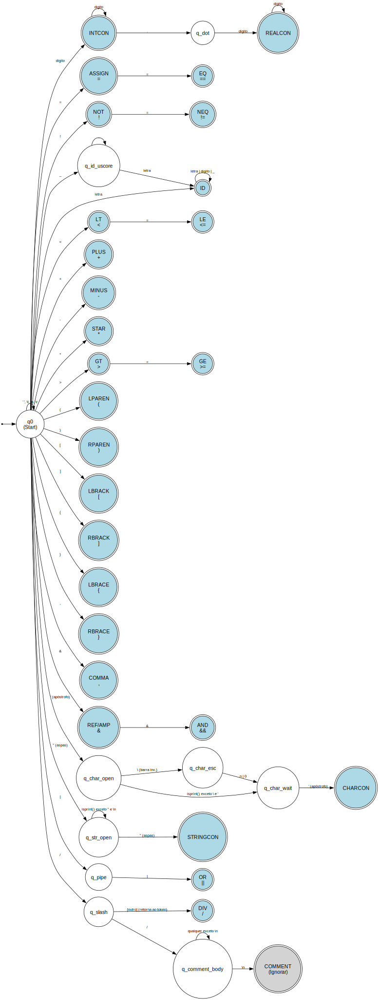

# doblock

## Design

### Lexer

- Streams tokens to the parser.

- 4 signals to indicate lexing state: processing, valid token, malformed token error, end of processing.

- DFA State

    - Lexeme buffer

    - Lexeme size

    - Token stack

    - File pointer

    - Auxiliary functions?

- Lexer Runtime

    - Returns result based on state signal

    - DFA traverses states via function pointers and updates the state signal
